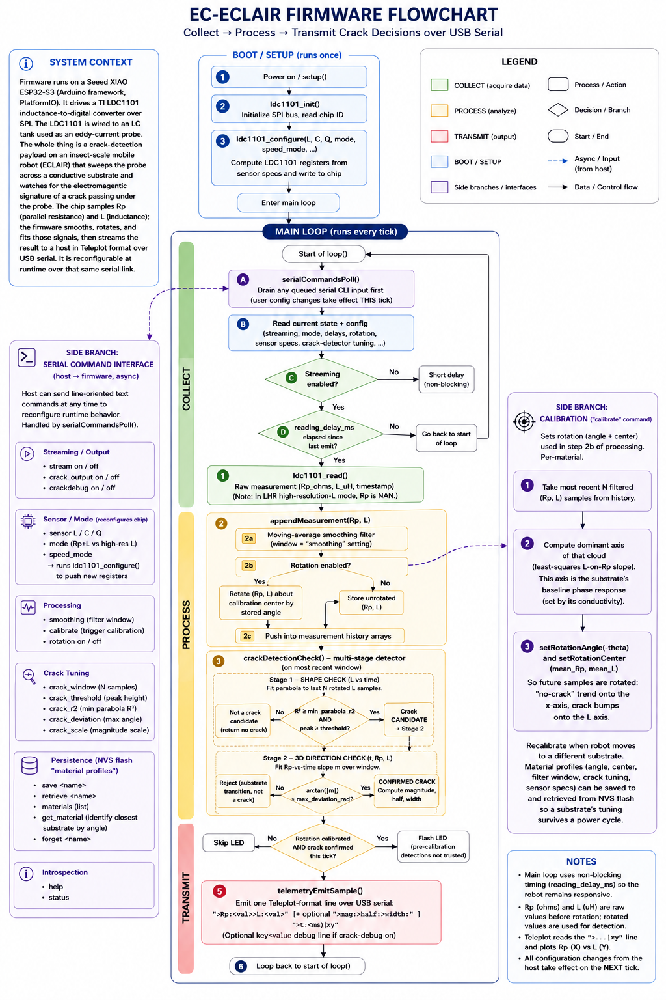

# EC-ECLAIR Eddy-Current Crack-Detection Firmware

PlatformIO firmware for a **Seeed XIAO ESP32-S3** that drives a **TI LDC1101**
inductance-to-digital converter over SPI. The LDC1101 reads an LC-tank eddy-current
probe carried by the **ECLAIR** insect-scale robot; as the robot sweeps the probe
across a conductive substrate, the firmware samples inductance (`L`) and parallel
resistance (`Rp`), runs them through a smoothing → rotation → fit pipeline, decides
whether a crack passed under the probe, and streams the result over USB serial in
[Teleplot](https://github.com/nesnes/teleplot) format. Everything is retunable at
runtime over that same serial link.



The diagram above is the map for this README: **COLLECT** (`ldc1101_read`) →
**PROCESS** (`appendMeasurement` smoothing/rotation + two-stage `crackDetectionCheck`)
→ **TRANSMIT** (`telemetryEmitSample`), with the serial CLI and per-material
calibration as side branches feeding the main loop.

## Quick start

Run from the project root (where `platformio.ini` lives):

```sh
pio run              # build
pio run -t upload    # build and flash the XIAO ESP32-S3
pio device monitor   # open the serial monitor (115200 baud)
```

Once connected, type `help` for the full command list or `status` for current
settings. Plot the stream live by pointing Teleplot at the same serial port.

## Running a robot experiment

The core workflow is **calibrate per substrate, then sweep**:

1. **Place the probe on the target substrate** and let the robot hold still (or sweep
   a clean, crack-free stretch) so the sensor sees the baseline.
2. **`calibrate`** — computes the substrate's baseline phase axis from recent samples
   and sets the rotation so "no-crack" motion lies on the x-axis and crack bumps land
   on the L axis. Recalibrate every time you move to a different material.
3. *(optional)* **`save <material>`** — persist the full tuning (rotation, filter
   window, crack thresholds, sensor specs) to NVS flash so it survives a power cycle.
   Later, `retrieve <material>` reloads it, or `get_material` tells you which stored
   profile the current substrate most resembles.
4. **Sweep the probe** across the region of interest. When a crack is confirmed the
   onboard LED flashes (only after calibration) and the serial line gains a
   `>mag:>half:>width:` triple.
5. **Tune if needed** (see below), then re-sweep.

Enable/disable output with `stream on|off`; add crack fields with `crack_output on`;
get a verbose per-tick tuning line with `crackdebug on`.

## Tuning knobs (serial commands)

| Command | Effect |
|---|---|
| `smoothing <n>` | Moving-average filter window (noise vs. responsiveness) |
| `crack_window <n>` | Number of samples the detector fits per check |
| `crack_threshold <v>` | Minimum fitted peak height to count as a crack |
| `crack_r2 <v>` | Minimum parabola R² for the Stage-1 shape check |
| `crack_deviation <rad>` | Max off-plane tilt for Stage-2 direction check (`π/2` disables it) |
| `crack_scale <v>` | Scale factor for the reported crack magnitude |
| `sensor <L> <C> <Q>`, `mode`, `speed_mode` | Sensor specs / conversion mode — reconfigure the LDC1101 |

## How detection works (in one paragraph)

**Stage 1 — shape:** fit a parabola to the most recent `crack_window` rotated `L`
samples; a strong, tall bump (`R² ≥ crack_r2`, peak `≥ crack_threshold`) is a *crack
candidate*. **Stage 2 — direction:** a real crack bumps `L` while `Rp` stays at the
calibrated baseline, so the candidate curve hugs the *t–L* plane; a material/patch
transition tilts it toward the `Rp` axis. The detector fits the `Rp`-vs-time slope `m`
and rejects the candidate when `arctan(|m|) > crack_deviation`. Both stages run on the
*rotated* signal, which is why calibration is a prerequisite for trustworthy output.

## Where things live (for modifying the firmware)

| Area | File |
|---|---|
| Main loop, boot defaults, LED | [src/main.cpp](src/main.cpp) |
| LDC1101 driver (ESP-IDF SPI, clean C API) | [lib/LDC1101/](lib/LDC1101/) |
| Smoothing + rotation + history | [src/measurement_arrays.cpp](src/measurement_arrays.cpp) |
| Two-stage crack detector | [src/crack_detection.cpp](src/crack_detection.cpp) |
| Per-substrate calibration | [src/calibration.cpp](src/calibration.cpp) |
| Serial CLI (runtime state) | [src/serial_commands.cpp](src/serial_commands.cpp) |
| NVS material profiles | [src/memory.cpp](src/memory.cpp) |

A few conventions worth knowing before you edit:

- **The driver is ESP32-specific.** `lib/LDC1101` is written against ESP-IDF
  (`driver/spi_master.h`, etc.) even though the app is an Arduino sketch. Keep it
  C-callable and prefer ESP-IDF SPI/GPIO APIs over Arduino `SPI.h`. SPI pins and bus
  come from `-D` build flags in `platformio.ini`, not source.
- **Adding a runtime tunable is a two-touch change:** add a getter/setter in the owning
  module plus a `processCommand` clause (and `help`/`status` line) in
  `serial_commands.cpp`. If it should travel with a material profile and survive a power
  cycle, also add a matching `putX`/`getX` pair in `memory.cpp` (NVS keys ≤ 15 chars).
- **Sensor params in `main.cpp` are boot defaults only** — the live values are owned by
  `serial_commands` and changeable at runtime.

See [CLAUDE.md](CLAUDE.md) for the full architecture reference and the LDC1101
datasheet under [lib/LDC1101/](lib/LDC1101/) for register-level details.
